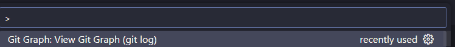
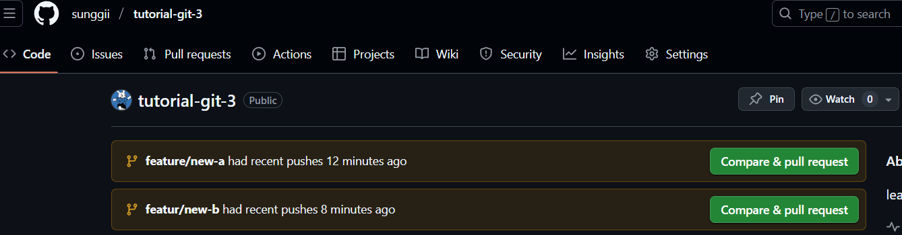
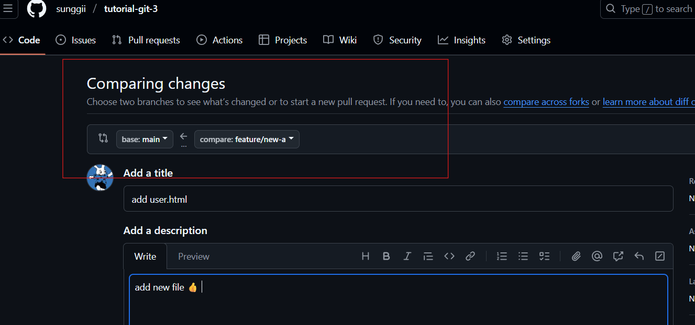

# What I learned
ref: [doc พี่ไมค์](https://docs.mikelopster.dev/c/basic/git/intro)

## Git Graph
* เป็น extention โหลดมาดู Graph แทน sourcetree
* วิธีดู Graph 
    1.  ```Ctrl + shift + p```
    2. เลือก

    

## คำสั่งพื้นฐาน
* ```git init```
* ```git add ``` and ```git commit``` ทำผ่าน UI

## คำสั่ง Branch
* ```git branch``` ใช้เช็ค branch ที่ทำงานอยู่
* ```git branch -m <ชื่อใหม่>```
* ```git merge <deverlop>``` คือ merge develop เข้า main
    * หลัง merge ให้พิม ```:wq``` ที่ terminal เพื่อออก
* ```feature/<ชื่อfeature>``` นิยมใช่ / ตอนทำ feature ใหม่

## Git server และคำสั่ง remote
* หลังจาก cop remote ให้ใช้ ```git push --all  origin``` เพื่ออัพทุก branch ขึ้น github
* ```git clone <url git>``` 
* ```git push <ตัวแปร> <branch ที่จะ push>``` **ตัวอย่าง** ```git push origin main```
* ```git pull <ตัวแปร> <branch ที่จะ pull>``` **ตัวอย่าง** ```git pull origin main```
* ```git fetch origin``` เอาไว้ดึงทุก branch ของ server มาลงเครื่ิง
    * แต่ถ้าอยากได้แค่บาง branch ```git fetch <ตัวแปร> <branch>```

## Hot to pull request
* ในการทำงานจริงต้องทำ ```pull request``` แทนการ merge เข้า main แบบมั่วซั่ว
* pull request เกิดจากการที่เราอัพงานขึ้น github จาก branch อื่น

1. กดเข้าไป


2. เช็คตรงนี้ให้ดี ถ้าเรียบร้อยดีก็กด ```create pull request```


